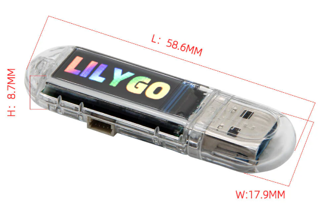

<a href="https://github.com/G4MEOVER18/usb-army-penetrator/blob/master/LICENSE"></a>
[](https://platformio.org)

# USB Army Penetrator

**Fork von [USB Army Knife by i-am-shodan](https://github.com/i-am-shodan/USBArmyKnife)** — erweitert um CYD-Board-Support, verbessertes T-Dongle-UI und G4MEOVER RadioRemote.

<div align="center">
  
</div>

Kompakte, verdeckte USB/WiFi-Penetrationstest-Plattform für Red-Teamer und Sicherheitsforscher. Einstecken, Payloads per DuckyScript ausführen, über WiFi exfiltrieren oder das Gerät hinterlassen und aus der Ferne steuern — alles vom Smartphone oder Browser aus.

> **Nur für autorisierte Sicherheitstests und Penetrationstests.** Ausschließlich auf Systemen einsetzen, die du besitzt oder für die du eine ausdrückliche schriftliche Genehmigung hast.

---

## Was ist anders als upstream?

Dieser Fork ergänzt:

| Erweiterung | Beschreibung |
|------------|-------------|
| **CYD-Board-Support** | Vollständiges TFT-Dashboard für den ESP32-2432S028R (Cheap Yellow Display) — Statusseite, Schnellstart-Buttons, Payload-Monitoring, Touch-Eingabe |
| **Verbessertes T-Dongle-UI** | Überarbeiteter Boot-Screen und mehrseitige Statusanzeige für den LilyGo T-Dongle S3 |
| **G4MEOVER RadioRemote** | Fernsteuerungs-Erweiterungen in WebServer.cpp für WiFi-gesteuerte Payload-Ausführung |
| **Erweitertes WebUI** | Ausgebautes Bootstrap-Interface (`ui/content/index.html`) mit zusätzlichen Steuerelementen |
| **USB NCM Fixes** | Zusätzliche Stabilitätskorrekturen in USBCore.cpp und USBMSC.cpp |
| **Agent-Verbesserungen** | SerialComms.cs und Program.cs für zuverlässigere Agent-Kommunikation |

---

## Features

- **USB HID Angriffe** — DuckyScript BadUSB, unterstützt mehrere Tastatur-Layouts
- **Mass Storage Emulation** — als USB-Laufwerk oder CDROM erscheinen
- **USB-Netzwerkgerät** — USB Ethernet / NCM-Adapter, PCAP-Aufzeichnung
- **WiFi & Bluetooth Angriffe** — über ESP32 Marauder (Deauth, Evil AP, PCAP)
- **Remote Agent** — Agent deployen, Befehle über Serial ausführen — auch auf gesperrten Systemen
- **VNC Screen Pull** — Bildschirm des Ziels über Geräte-WiFi via noVNC einsehen
- **Hot Mic** — Mikrofon-Audio über WiFi streamen
- **Custom TFT UI** — Skripte mit eigenen Ladebildschirmen und Fortschrittsbalken

---

## Unterstützte Hardware

| Hardware | Hinweise |
|----------|---------|
| **LilyGo T-Dongle S3** ⭐ | Empfohlen. USB-A-Formfaktor, Display, versteckte SD-Karte |
| **CYD ESP32-2432S028R** | Neu in diesem Fork — 320×240 Touch-TFT, eigenständiges Dashboard |
| **Evil Crow Cable Wind** | Verdecktes USB-Kabel mit verstecktem ESP32-S3 |
| **T-Watch S3** | Smartwatch-Formfaktor |
| **Waveshare ESP32-S3 1.47"** | Großes Display |
| **M5Stack AtomS3U** | Klein, keine SD |
| **ESP32 UDisk / ESP32 Key** | Budget-Option, kein Web-Interface |
| **Waveshare RP2040-GEEK** | Kein Marauder, kein NCM |

---

## Schnellstart

### Voraussetzungen

- [Visual Studio Code](https://code.visualstudio.com/) + [PlatformIO-Extension](https://platformio.org/install/ide?install=vscode)
- Oder PlatformIO Core CLI: `pip install platformio`

### Build & Flash

```bash
# Repo klonen
git clone https://github.com/G4MEOVER18/usb-army-penetrator.git
cd usb-army-penetrator

# In VSCode öffnen
code .

# In PlatformIO: Board-Environment auswählen, dann Build → Upload
# CLI:
pio run -e LILYGO-T-Dongle-S3 -t upload
pio run -e CYD-ESP32-2432S028 -t upload
```

Verfügbare PlatformIO-Environments (in `platformio.ini`):
```
LILYGO-T-Dongle-S3
CYD-ESP32-2432S028
M5Stack-AtomS3U
Waveshare-ESP32-S3-GEEK
Waveshare-RP2040-GEEK
EvilCrowWind
TWatchS3
```

### Erste Inbetriebnahme

1. **Flashen** — Firmware für das eigene Board aufgespielt (siehe oben)
2. **SD-Karte** mit Payloads einlegen (DuckyScript `.ds`-Dateien) — optional
3. **Gerät** in einen USB-Port einstecken
4. **WLAN** des Geräts verbinden (Standard-SSID im Web-UI konfigurierbar)
5. **Web-Interface** öffnen: `http://4.3.2.1:8080`
6. **DuckyScript-Payload** laden oder schreiben und auf "Ausführen" klicken

---

## Bedienungsanleitung

### Web-Interface

Nach Verbindung mit dem WLAN-AP des Geräts und Aufruf von `http://4.3.2.1:8080`:

| Bereich | Beschreibung |
|---------|-------------|
| **Status** | Aktueller USB-Modus, WLAN-Zustand, Laufzeit, Payload-Status |
| **Payload-Editor** | DuckyScript-Angriffe schreiben, laden und ausführen |
| **Dateimanager** | SD-Karte durchsuchen, Dateien hoch- und herunterladen |
| **Einstellungen** | WLAN-Zugangsdaten, AP-Name, USB-Modus |
| **VNC** | Bildschirmansicht (erfordert Agent-Deployment) |

### DuckyScript Kurzreferenz

```duckyscript
# Text eingeben
STRING Hallo Welt
ENTER

# Tastenkombinationen
CTRL ALT DELETE
GUI r
STRING cmd
ENTER

# Verzögerung (Millisekunden)
DELAY 1000

# WLAN — AP verbinden
WIFI_CONNECT ssid passwort

# Marauder-Befehl ausführen
ESP32M scan -w -t 5

# Bild auf TFT anzeigen
SHOW_IMAGE /meinbild.png

# Payload-Dateien selbst zerstören
WIPE_STORAGE
```

Vollständige DuckyScript-Referenz: [USB Army Knife Wiki](https://github.com/i-am-shodan/USBArmyKnife/wiki)

### CYD-Dashboard (ESP32-2432S028R)

Das CYD-Board zeigt ein 4-seitiges TFT-Interface:

| Seite | Inhalt |
|-------|--------|
| **Seite 0** | Dashboard — WLAN, SD, USB-Modus, RAM, Laufzeit, Netzwerkinfo |
| **Seite 1** | Schnellstart — 6 Payload-Slots per Touch starten |
| **Seite 2** | Payload-Status — aktuell laufendes Skript, letzte Ausgabe |
| **Seite 3** | Info / Systemdaten |

- **Touch** auf Seite 0 → öffnet Schnellstart
- **Button** → wechselt Seiten

### Agent-Deployment

Der C#-Agent (`tools/Agent/`) ermöglicht verdeckte Befehlsausführung:

```duckyscript
# Agent deployen (Windows)
INCLUDE install_agent_and_run_command/us-autorun.ds

# Nach Deployment — Befehle über Web-Interface senden
# Befehle werden auf dem Ziel ausgeführt, Ausgabe erscheint im WebUI
```

Der Agent kommuniziert über die USB-Seriell-Schnittstelle — kein Netzwerk-Socket auf dem Ziel, keine ausgehenden Verbindungen, minimaler Erkennungs-Fußabdruck.

---

## Beispiele

| Beispiel | Beschreibung |
|---------|-------------|
| [Covert Storage](./examples/covertstorage/) | Als zwei verschiedene USB-Laufwerke erscheinen — volle SD beim ersten Einstecken, harmloses Laufwerk danach |
| [Progress Bar](./examples/progressbar/) | Hollywood-artiges Angriffs-UI mit animiertem Fortschritt |
| [Ultimate RickRoll](./examples/rickroll/) | Tastatur-Injection + Marauder WiFi-Beacon-Spam |
| [USB Ethernet PCAP](./examples/usb_ethernet_pcap/) | USB-NIC + automatische PCAP-Aufzeichnung |
| [Install Agent](./examples/install_agent_and_run_command/) | Agent deployen, Befehle aus der Ferne ausführen |
| [VNC Screen Pull](./examples/vnc/) | Agent mit VNC-Server deployen, Bildschirm über WebUI einsehen |
| [Simple UI](./examples/simple_ui/) | Schaltflächen-gesteuerter Skript-Launcher mit eigenem Screen |
| [Hot Mic](./examples/hotmic/) | Mikrofon-Audio über WiFi streamen |
| [Linux Panic](./examples/linux_panic/) | Fehlerhafte Dateisystem-Emulation löst Kernel-Panic bei Automount aus |
| [Evil USB NIC](./examples/malicious_ethernet_adapter/) | Gefälschter NIC, der eine Treiber-CDROM präsentiert |
| [EvilAP](./examples/evilap/) | Täuschender WiFi-AP via Marauder |
| [WiFi Deauth + PCAP](./examples/wifi_deauth_and_crypt_capture/) | Deauth-Clients, Handshake aufzeichnen |

---

## Build aus Quellcode

```bash
# PlatformIO CLI installieren
pip install platformio

# Alle Environments bauen
pio run

# Einzelnes Board bauen
pio run -e LILYGO-T-Dongle-S3

# Flashen
pio run -e LILYGO-T-Dongle-S3 -t upload
```

---

## Quellen / Danksagung

Dieses Projekt ist ein Fork von **[USB Army Knife](https://github.com/i-am-shodan/USBArmyKnife)** von [@i-am-shodan](https://github.com/i-am-shodan), lizenziert unter MIT.

WiFi/Bluetooth-Angriffsfähigkeiten via **[ESP32 Marauder](https://github.com/justcallmekoko/ESP32Marauder)** von justcallmekoko.

---

## Lizenz

MIT License — siehe [LICENSE](LICENSE)

Originalwerk Copyright (c) 2024 i-am-shodan  
Fork-Änderungen Copyright (c) 2026 G4MEOVER18

---

## Kontakt & Support

**Entwickler:** Yanis Ameseder · **E-Mail:** [g4me.over.18@gmail.com](mailto:g4me.over.18@gmail.com)

Fragen, Bug-Reports und Feature-Wünsche gerne per [Issue](https://github.com/G4MEOVER18/usb-army-penetrator/issues) oder E-Mail.

Wenn dieses Projekt deiner eigenen Forschung geholfen hat:

**Bitcoin:** `39vZWmnUwDReQ15BwqQXzyqVQ6U8LardEf`  
**PayPal:** [paypal.me/Freakbank1](https://paypal.me/Freakbank1)
